# Bus Tracking System - Class Diagram

## Overview
This document contains a comprehensive class diagram for the Bus Tracking System, showing the relationships between all major classes, interfaces, and services in both the backend and frontend.

## PlantUML Class Diagram

```plantuml
@startuml BusTrackingSystemClassDiagram

!theme plain
skinparam classAttributeIconSize 0
skinparam classFontSize 12
skinparam classFontStyle bold
skinparam packageStyle rectangle

' ===== BACKEND PACKAGE =====
package "Backend" {
  
  ' ===== DATABASE MODELS =====
  package "Models" {
    class DatabaseUser {
      +id: string
      +email: string
      +role: 'student' | 'driver' | 'admin'
      +first_name?: string
      +last_name?: string
      +phone?: string
      +profile_photo_url?: string
      +created_at?: string
      +updated_at?: string
    }
    
    class DatabaseBus {
      +id: string
      +code: string
      +name?: string
      +number_plate: string
      +capacity: number
      +model?: string
      +year?: number
      +bus_image_url?: string
      +assigned_driver_id?: string
      +route_id?: string
      +is_active: boolean
      +created_at?: string
      +updated_at?: string
    }
    
    class DatabaseRoute {
      +id: string
      +name: string
      +description?: string
      +geom: PostGISGeometry
      +stops?: PostGISGeometry
      +total_distance_m?: number
      +distance_km?: number
      +estimated_duration_minutes?: number
      +is_active: boolean
      +origin?: string
      +destination?: string
      +custom_origin?: string
      +custom_destination?: string
      +use_custom_arrival?: boolean
      +use_custom_starting_point?: boolean
      +current_eta_minutes?: number
    }
    
    class DatabaseLiveLocation {
      +id: string
      +bus_id: string
      +location: PostGISGeometry
      +speed_kmh?: number
      +heading_degrees?: number
      +recorded_at: string
    }
    
    class DatabaseDriver {
      +id: string
      +driver_id: string
      +driver_name?: string
      +license_no?: string
      +phone?: string
      +email?: string
      +photo_url?: string
      +created_at?: string
    }
    
    class DatabaseBusStop {
      +id: string
      +route_id: string
      +name: string
      +description?: string
      +location: PostGISGeometry
      +stop_order: number
      +estimated_time_from_start?: number
      +is_active: boolean
    }
    
    class DatabaseDriverBusAssignment {
      +id: string
      +driver_id: string
      +bus_id: string
      +route_id?: string
      +is_active: boolean
      +assigned_at?: string
    }
  }
  
  ' ===== SERVICES =====
  package "Services" {
    class AdminService {
      +{static} getAllBuses(): Promise<BusData[]>
      +{static} getBusById(busId: string): Promise<BusData>
      +{static} createBus(busData: BusData): Promise<string>
      +{static} updateBus(busId: string, busData: Partial<BusData>): Promise<void>
      +{static} deleteBus(busId: string): Promise<void>
      +{static} getAllDrivers(): Promise<DriverData[]>
      +{static} createDriver(driverData: DriverData): Promise<string>
      +{static} updateDriver(driverId: string, driverData: Partial<DriverData>): Promise<void>
      +{static} deleteDriver(driverId: string): Promise<void>
      +{static} getAnalytics(): Promise<AnalyticsData>
    }
    
    class RouteService {
      +{static} getAllRoutes(): Promise<DatabaseRoute[]>
      +{static} getRouteById(routeId: string): Promise<DatabaseRoute>
      +{static} createRoute(routeData: Partial<DatabaseRoute>): Promise<string>
      +{static} updateRoute(routeId: string, routeData: Partial<DatabaseRoute>): Promise<void>
      +{static} deleteRoute(routeId: string): Promise<void>
      +{static} calculateETA(busId: string, routeId: string): Promise<number>
      +{static} getRouteStops(routeId: string): Promise<DatabaseBusStop[]>
    }
    
    class LocationService {
      +{static} saveLocationUpdate(locationData: LocationUpdate): Promise<void>
      +{static} getLiveLocation(busId: string): Promise<DatabaseLiveLocation>
      +{static} getLocationHistory(busId: string, startTime: string, endTime: string): Promise<DatabaseLiveLocation[]>
      +{static} getDriverBusInfo(driverId: string): Promise<DriverBusInfo>
      +{static} updateBusLocation(busId: string, latitude: number, longitude: number, speed?: number, heading?: number): Promise<void>
    }
    
    class StorageService {
      +{static} uploadFile(file: Buffer, fileName: string, folder: string): Promise<string>
      +{static} deleteFile(fileUrl: string): Promise<void>
      +{static} getFileUrl(fileName: string): string
    }
  }
  
  ' ===== WEBSOCKET =====
  package "WebSocket" {
    class WebSocketServer {
      +initializeWebSocket(io: SocketIOServer): void
      +handleDriverAuthentication(socket: AuthenticatedSocket, token: string): Promise<void>
      +handleLocationUpdate(socket: AuthenticatedSocket, locationData: LocationUpdate): Promise<void>
      +handleStudentConnection(socket: AuthenticatedSocket): void
      +broadcastBusLocation(busId: string, location: BusLocation): void
    }
  }
  
  ' ===== MIDDLEWARE =====
  package "Middleware" {
    class AuthMiddleware {
      +{static} authenticateToken(req: Request, res: Response, next: NextFunction): Promise<void>
      +{static} requireRole(role: string): (req: Request, res: Response, next: NextFunction) => Promise<void>
    }
    
    class CORSMiddleware {
      +{static} configureCORS(): (req: Request, res: Response, next: NextFunction) => void
    }
    
    class RateLimitMiddleware {
      +{static} configureRateLimit(): (req: Request, res: Response, next: NextFunction) => void
    }
  }
}

' ===== FRONTEND PACKAGE =====
package "Frontend" {
  
  ' ===== TYPES =====
  package "Types" {
    interface User {
      +id: string
      +email: string
      +role: 'student' | 'driver' | 'admin'
      +first_name?: string
      +last_name?: string
      +full_name?: string
      +phone?: string
      +profile_photo_url?: string
    }
    
    interface Bus {
      +id: string
      +code: string
      +name?: string
      +number_plate: string
      +capacity: number
      +model?: string
      +year?: number
      +bus_image_url?: string
      +assigned_driver_id?: string
      +route_id?: string
      +is_active: boolean
      +driver_full_name?: string
      +route_name?: string
    }
    
    interface Route {
      +id: string
      +name: string
      +description?: string
      +geom: any
      +stops?: any
      +total_distance_m?: number
      +distance_km?: number
      +estimated_duration_minutes?: number
      +is_active: boolean
      +origin?: string
      +destination?: string
      +current_eta_minutes?: number
    }
    
    interface BusLocation {
      +busId: string
      +driverId: string
      +latitude: number
      +longitude: number
      +timestamp: string
      +speed?: number
      +heading?: number
      +eta?: ETAInfo
      +nearStop?: NearStopInfo
    }
    
    interface ETAInfo {
      +bus_id: string
      +route_id: string
      +current_location: [number, number]
      +next_stop: string
      +distance_remaining: number
      +estimated_arrival_minutes: number
      +is_near_stop: boolean
    }
  }
  
  ' ===== SERVICES =====
  package "Services" {
    class AuthService {
      -currentUser: User | null
      -currentSession: Session | null
      -currentProfile: UserProfile | null
      -authStateChangeListener: (() => void) | null
      -_isInitialized: boolean
      +constructor()
      +getCurrentUser(): User | null
      +getCurrentSession(): Session | null
      +getCurrentProfile(): UserProfile | null
      +signIn(email: string, password: string): Promise<{ user: User; session: Session }>
      +signOut(): Promise<void>
      +onAuthStateChange(listener: () => void): void
      +removeAuthStateChangeListener(): void
      -initializeAuth(): Promise<void>
      -loadUserProfile(userId: string): Promise<void>
    }
    
    class WebSocketService {
      +socket: Socket | null
      -_isConnected: boolean
      -connectionState: 'disconnected' | 'connecting' | 'connected' | 'reconnecting'
      -reconnectAttempts: number
      -maxReconnectAttempts: number
      -heartbeatInterval: NodeJS.Timeout | null
      +connect(): Promise<void>
      +disconnect(): void
      +emit(event: string, data: any): void
      +on(event: string, callback: (data: any) => void): void
      +off(event: string): void
      -handleConnect(): void
      -handleDisconnect(): void
      -handleError(error: Error): void
      -startHeartbeat(): void
      -stopHeartbeat(): void
    }
    
    class BusService {
      +getAllBuses(): Promise<Bus[]>
      +getBusById(busId: string): Promise<Bus>
      +getBusLocation(busId: string): Promise<BusLocation>
      +getBusRoute(busId: string): Promise<Route>
      +updateBusLocation(busId: string, latitude: number, longitude: number): Promise<void>
    }
    
    class AdminApiService {
      +getAnalytics(): Promise<AnalyticsData>
      +getSystemHealth(): Promise<HealthResponse>
      +getUserManagement(): Promise<User[]>
      +getBusManagement(): Promise<Bus[]>
      +getRouteManagement(): Promise<Route[]>
    }
    
    class MapService {
      +initializeMap(containerId: string): Promise<void>
      +addBusMarker(busId: string, location: [number, number]): void
      +updateBusLocation(busId: string, location: [number, number]): void
      +addRoutePath(routeId: string, coordinates: [number, number][]): void
      +addBusStops(stops: BusStop[]): void
      +fitBounds(coordinates: [number, number][]): void
    }
    
    class StorageService {
      +uploadFile(file: File, folder: string): Promise<string>
      +deleteFile(fileUrl: string): Promise<void>
      +getFileUrl(fileName: string): string
    }
  }
  
  ' ===== STORES =====
  package "Stores" {
    class useAuthStore {
      +isAuthenticated: boolean
      +user: User | null
      +loading: boolean
      +error: string | null
      +setAuthState(state: Partial<AuthState>): void
      +setUser(user: User | null): void
      +setLoading(loading: boolean): void
      +setError(error: string | null): void
      +clearError(): void
      +isAdmin(): boolean
      +isDriver(): boolean
      +isStudent(): boolean
    }
    
    class useBusStore {
      +buses: Bus[]
      +selectedBus: Bus | null
      +loading: boolean
      +error: string | null
      +setBuses(buses: Bus[]): void
      +setSelectedBus(bus: Bus | null): void
      +fetchBuses(): Promise<void>
      +updateBusLocation(busId: string, location: BusLocation): void
    }
    
    class useLocationStore {
      +liveLocations: Map<string, BusLocation>
      +locationHistory: Map<string, BusLocation[]>
      +loading: boolean
      +error: string | null
      +updateLiveLocation(busId: string, location: BusLocation): void
      +addLocationToHistory(busId: string, location: BusLocation): void
      +getLocationHistory(busId: string): BusLocation[]
    }
  }
  
  ' ===== COMPONENTS =====
  package "Components" {
    class App {
      +render(): JSX.Element
      -handleAuthStateChange(): void
      -handleHealthCheck(): void
    }
    
    class DriverDashboard {
      +render(): JSX.Element
      -handleLocationUpdate(): void
      -handleRouteSelection(): void
      -handleStartTrip(): void
      -handleEndTrip(): void
    }
    
    class DriverInterface {
      +render(): JSX.Element
      -handleLocationSharing(): void
      -handleNavigation(): void
      -handleEmergencyStop(): void
    }
    
    class OptimizedStudentMap {
      +render(): JSX.Element
      -initializeMap(): void
      -updateBusMarkers(): void
      -handleBusSelection(): void
      -handleRouteDisplay(): void
    }
    
    class AdminDashboard {
      +render(): JSX.Element
      -handleUserManagement(): void
      -handleBusManagement(): void
      -handleRouteManagement(): void
      -handleAnalytics(): void
    }
    
    class FileUpload {
      +render(): JSX.Element
      -handleFileSelect(): void
      -handleUpload(): Promise<void>
      -handleDragDrop(): void
    }
  }
  
  ' ===== HOOKS =====
  package "Hooks" {
    class useApiQueries {
      +useHealthCheck(): UseQueryResult<HealthResponse>
      +useBuses(): UseQueryResult<Bus[]>
      +useRoutes(): UseQueryResult<Route[]>
      +useBusLocation(busId: string): UseQueryResult<BusLocation>
      +useAnalytics(): UseQueryResult<AnalyticsData>
    }
  }
}

' ===== RELATIONSHIPS =====

' Backend Relationships
DatabaseUser ||--o{ DatabaseDriver : "has"
DatabaseBus ||--o{ DatabaseLiveLocation : "tracks"
DatabaseRoute ||--o{ DatabaseBusStop : "contains"
DatabaseRoute ||--o{ DatabaseBus : "assigned_to"
DatabaseDriver ||--o{ DatabaseDriverBusAssignment : "assigned_to"
DatabaseBus ||--o{ DatabaseDriverBusAssignment : "assigned_to"
DatabaseRoute ||--o{ DatabaseDriverBusAssignment : "assigned_to"

AdminService ..> DatabaseBus : "manages"
AdminService ..> DatabaseDriver : "manages"
RouteService ..> DatabaseRoute : "manages"
RouteService ..> DatabaseBusStop : "manages"
LocationService ..> DatabaseLiveLocation : "manages"
LocationService ..> DatabaseBus : "tracks"
StorageService ..> DatabaseBus : "stores_images"
StorageService ..> DatabaseDriver : "stores_photos"

WebSocketServer ..> LocationService : "uses"
WebSocketServer ..> RouteService : "uses"
WebSocketServer ..> DatabaseLiveLocation : "broadcasts"

' Frontend Relationships
AuthService ..> User : "manages"
WebSocketService ..> BusLocation : "receives"
BusService ..> Bus : "manages"
BusService ..> BusLocation : "tracks"
AdminApiService ..> Bus : "manages"
AdminApiService ..> Route : "manages"
MapService ..> BusLocation : "displays"
MapService ..> Route : "displays"

useAuthStore ..> User : "stores"
useBusStore ..> Bus : "stores"
useLocationStore ..> BusLocation : "stores"

App ..> useAuthStore : "uses"
App ..> AuthService : "uses"
DriverDashboard ..> WebSocketService : "uses"
DriverDashboard ..> BusService : "uses"
OptimizedStudentMap ..> MapService : "uses"
OptimizedStudentMap ..> WebSocketService : "uses"
AdminDashboard ..> AdminApiService : "uses"
AdminDashboard ..> useAuthStore : "uses"

useApiQueries ..> BusService : "uses"
useApiQueries ..> AdminApiService : "uses"

' Cross-package Relationships
AuthService ..> DatabaseUser : "authenticates"
WebSocketService ..> DatabaseLiveLocation : "receives"
BusService ..> DatabaseBus : "manages"
RouteService ..> DatabaseRoute : "manages"

@enduml
```

## Key Relationships Explained

### 1. **User Management**
- `DatabaseUser` is the core user entity with roles (student, driver, admin)
- `DatabaseDriver` extends user functionality for drivers
- `AuthService` manages authentication and user sessions

### 2. **Bus Management**
- `DatabaseBus` represents physical buses with capacity and assignment info
- `DatabaseDriverBusAssignment` manages driver-bus-route assignments
- `AdminService` provides CRUD operations for bus management

### 3. **Route Management**
- `DatabaseRoute` contains route geometry and configuration
- `DatabaseBusStop` represents stops along routes
- `RouteService` handles route operations and ETA calculations

### 4. **Location Tracking**
- `DatabaseLiveLocation` stores real-time bus locations
- `LocationService` manages location updates and history
- `WebSocketService` provides real-time communication

### 5. **Frontend Architecture**
- **Services**: Handle API communication and business logic
- **Stores**: Manage application state (Zustand)
- **Components**: React components for UI
- **Hooks**: Custom React hooks for data fetching

### 6. **Real-time Communication**
- WebSocket connections between frontend and backend
- Real-time location updates from drivers to students
- Live ETA calculations and notifications

## Design Patterns Used

1. **Service Layer Pattern**: Backend services encapsulate business logic
2. **Repository Pattern**: Database models abstract data access
3. **Observer Pattern**: WebSocket events for real-time updates
4. **State Management Pattern**: Zustand stores for frontend state
5. **Factory Pattern**: ServiceFactory for creating service instances
6. **Singleton Pattern**: AuthService and WebSocketService instances

## Technology Stack

- **Backend**: Node.js, Express, PostgreSQL with PostGIS
- **Frontend**: React, TypeScript, Vite
- **Real-time**: Socket.IO
- **State Management**: Zustand
- **Database**: Supabase (PostgreSQL)
- **Maps**: Leaflet/OpenStreetMap
- **Authentication**: Supabase Auth

This class diagram provides a comprehensive view of the bus tracking system's architecture, showing how all components work together to provide real-time bus tracking functionality for students, drivers, and administrators.

