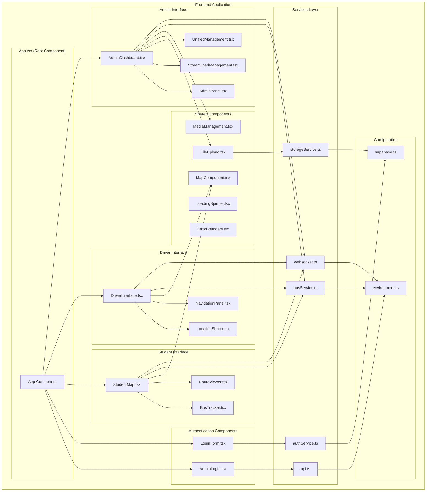
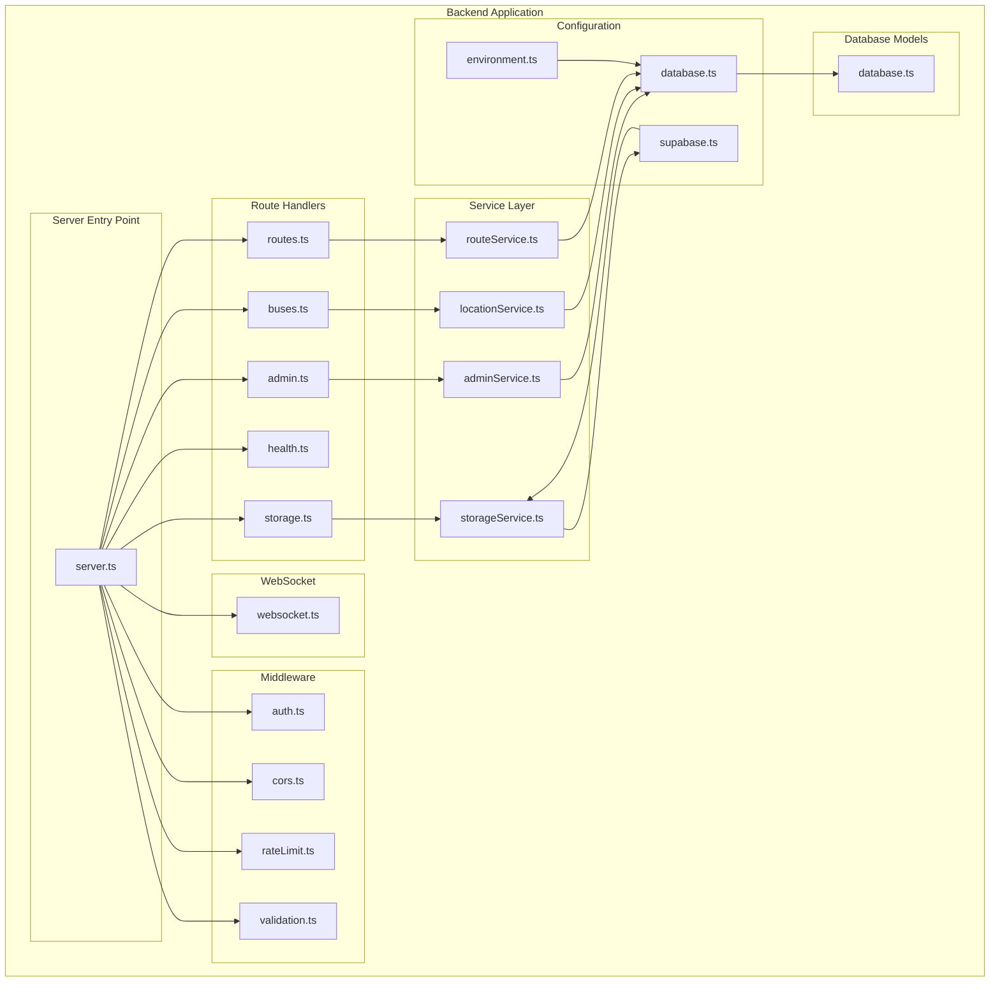
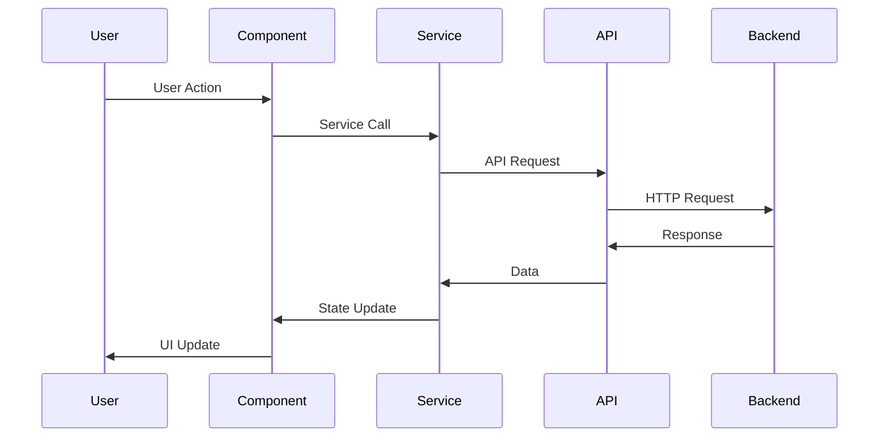
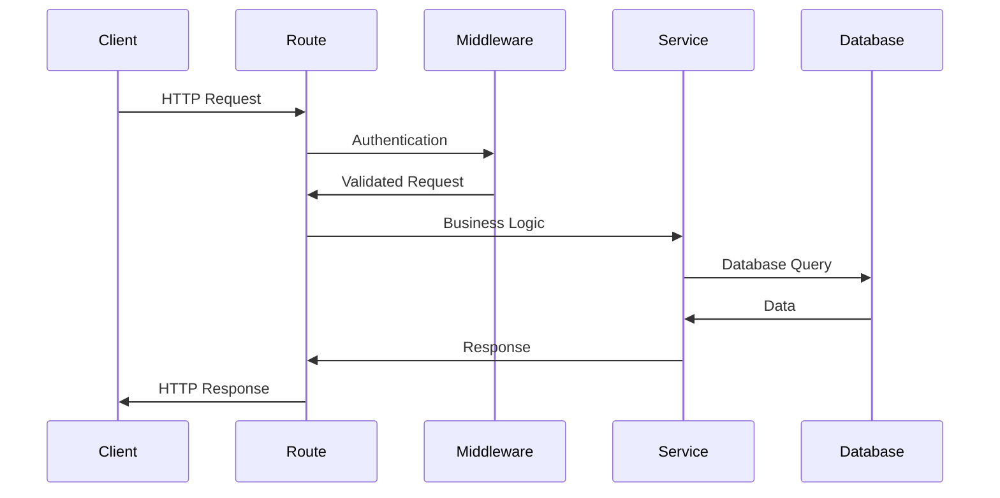
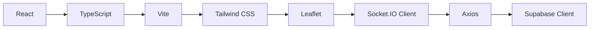
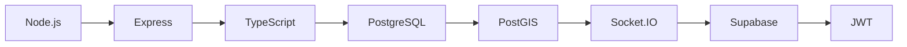

# Component Architecture

## Overview

This document provides a detailed view of the component architecture for the University Bus Tracking System, including both frontend React components and backend service architecture.

## Frontend Component Architecture



## Backend Service Architecture



## Component Details

### Frontend Components

#### 1. Core Application Components

**App.tsx**
- **Purpose**: Root component that manages routing and global state
- **Responsibilities**: 
  - Route management
  - Authentication state
  - Global error handling
  - Theme management

**AdminLogin.tsx**
- **Purpose**: Admin authentication interface
- **Features**:
  - Email/password login
  - JWT token management
  - Role-based access control
  - Error handling

#### 2. Student Interface Components

**StudentMap.tsx**
- **Purpose**: Main map interface for students
- **Features**:
  - Real-time bus tracking
  - Interactive map display
  - Route visualization
  - ETA calculations

**BusTracker.tsx**
- **Purpose**: Bus location tracking component
- **Features**:
  - Live bus positions
  - Speed and heading display
  - Bus information panel
  - Location history

**RouteViewer.tsx**
- **Purpose**: Route display and navigation
- **Features**:
  - Route path visualization
  - Stop locations
  - Distance and time estimates
  - Route selection

#### 3. Driver Interface Components

**DriverInterface.tsx**
- **Purpose**: Main driver application interface
- **Features**:
  - Location sharing controls
  - Route navigation
  - Status updates
  - Emergency alerts

**LocationSharer.tsx**
- **Purpose**: GPS location sharing component
- **Features**:
  - GPS permission handling
  - Location accuracy settings
  - Manual location input
  - Sharing status indicators

**NavigationPanel.tsx**
- **Purpose**: Route navigation assistance
- **Features**:
  - Turn-by-turn directions
  - Route deviation alerts
  - ETA updates
  - Traffic information

#### 4. Admin Interface Components

**AdminDashboard.tsx**
- **Purpose**: Main admin control panel
- **Features**:
  - System overview
  - Real-time statistics
  - Quick actions
  - Alert management

**AdminPanel.tsx**
- **Purpose**: Administrative controls
- **Features**:
  - User management
  - System configuration
  - Access control
  - Settings management

**StreamlinedManagement.tsx**
- **Purpose**: Simplified management interface
- **Features**:
  - Bus fleet management
  - Route management
  - Driver assignment
  - Quick operations

**UnifiedManagement.tsx**
- **Purpose**: Comprehensive management interface
- **Features**:
  - Full system control
  - Advanced analytics
  - Detailed reporting
  - System monitoring

#### 5. Shared Components

**FileUpload.tsx**
- **Purpose**: File upload functionality
- **Features**:
  - Drag-and-drop upload
  - File validation
  - Progress indicators
  - Error handling

**MediaManagement.tsx**
- **Purpose**: Media file management
- **Features**:
  - Image gallery
  - Document viewer
  - File organization
  - Bulk operations

**MapComponent.tsx**
- **Purpose**: Reusable map component
- **Features**:
  - Leaflet integration
  - Custom markers
  - Interactive controls
  - Responsive design

### Backend Components

#### 1. Route Handlers

**admin.ts**
- **Purpose**: Admin-specific API endpoints
- **Endpoints**:
  - User management
  - System configuration
  - Analytics and reporting
  - Access control

**buses.ts**
- **Purpose**: Bus management API
- **Endpoints**:
  - CRUD operations for buses
  - Bus assignment
  - Status updates
  - Location tracking

**routes.ts**
- **Purpose**: Route management API
- **Endpoints**:
  - Route CRUD operations
  - Geospatial queries
  - Route optimization
  - Stop management

**storage.ts**
- **Purpose**: File storage API
- **Endpoints**:
  - File upload/download
  - Image processing
  - Document management
  - CDN integration

#### 2. Service Layer

**adminService.ts**
- **Purpose**: Admin business logic
- **Functions**:
  - User management
  - System analytics
  - Configuration management
  - Reporting generation

**locationService.ts**
- **Purpose**: Location tracking logic
- **Functions**:
  - GPS data processing
  - ETA calculations
  - Route matching
  - Geospatial queries

**routeService.ts**
- **Purpose**: Route management logic
- **Functions**:
  - Route optimization
  - Distance calculations
  - Stop management
  - Schedule handling

**storageService.ts**
- **Purpose**: File storage logic
- **Functions**:
  - File validation
  - Upload processing
  - Image optimization
  - Storage management

#### 3. Middleware

**auth.ts**
- **Purpose**: Authentication middleware
- **Functions**:
  - JWT validation
  - Role verification
  - Session management
  - Access control

**cors.ts**
- **Purpose**: Cross-origin resource sharing
- **Functions**:
  - CORS configuration
  - Security headers
  - Request validation
  - Response handling

**rateLimit.ts**
- **Purpose**: Rate limiting middleware
- **Functions**:
  - Request throttling
  - IP-based limiting
  - Burst protection
  - Abuse prevention

## Component Communication

### Frontend Communication Flow



### Backend Communication Flow



## State Management

### Frontend State Structure

```typescript
interface AppState {
  // Authentication
  user: User | null;
  isAuthenticated: boolean;
  token: string | null;
  
  // Bus Tracking
  buses: Bus[];
  selectedBus: Bus | null;
  busLocations: Map<string, Location>;
  
  // Routes
  routes: Route[];
  selectedRoute: Route | null;
  
  // UI State
  loading: boolean;
  error: string | null;
  notifications: Notification[];
  
  // Map State
  mapCenter: [number, number];
  mapZoom: number;
  mapLayers: MapLayer[];
}
```

### Backend State Management

```typescript
interface ServerState {
  // Database Connections
  dbPool: Pool;
  supabaseClient: SupabaseClient;
  
  // WebSocket Connections
  connectedClients: Map<string, Socket>;
  userRooms: Map<string, string[]>;
  
  // Caching
  busCache: Map<string, Bus>;
  routeCache: Map<string, Route>;
  
  // System Metrics
  activeConnections: number;
  requestCount: number;
  errorCount: number;
}
```

## Component Dependencies

### Frontend Dependencies



### Backend Dependencies



This component architecture provides a clear understanding of how the University Bus Tracking System is structured, from the user interface components to the backend services and data management.
