# Data Flow Diagrams

## Overview

This document provides detailed data flow diagrams for the University Bus Tracking System, showing how data moves between different components, services, and users.

## 1. Overall System Data Flow

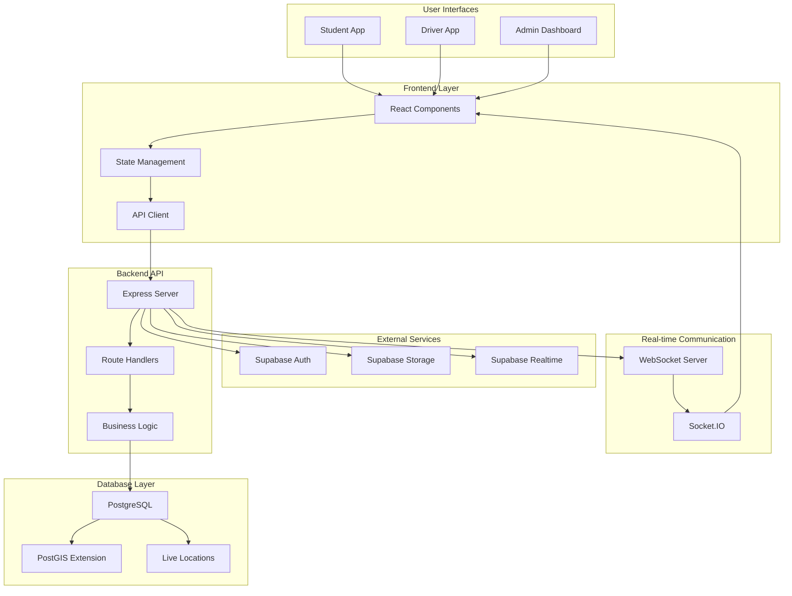

## 2. Authentication Data Flow

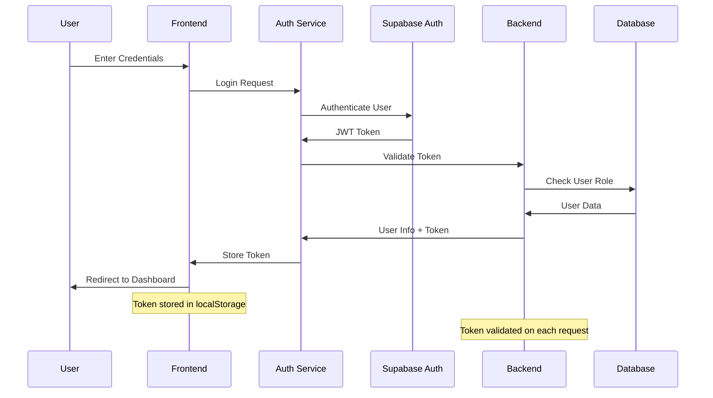

## 3. Real-time Location Tracking Data Flow

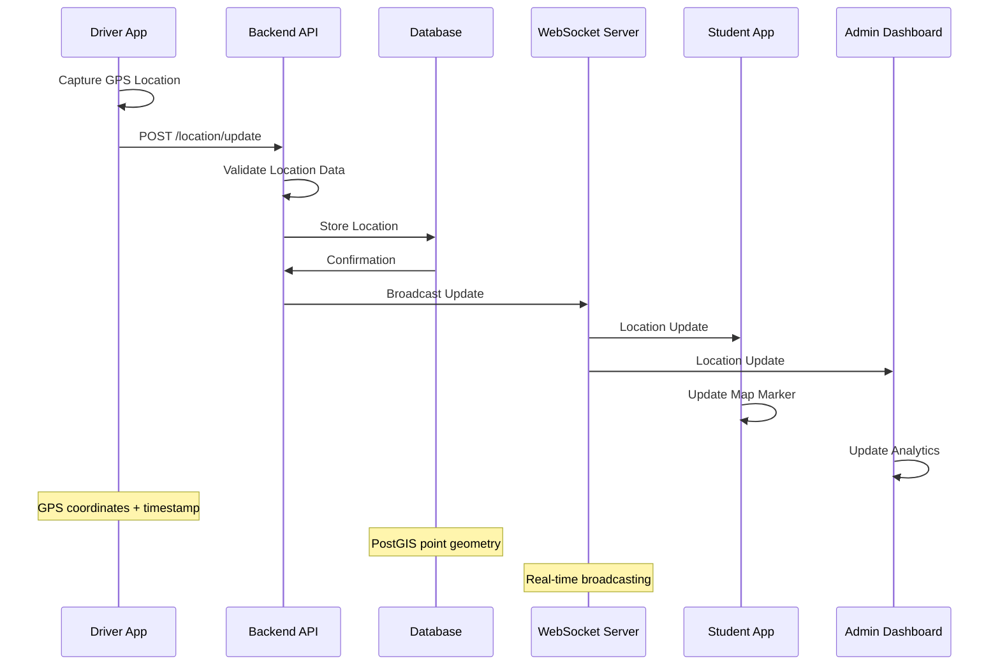

## 4. Bus Management Data Flow

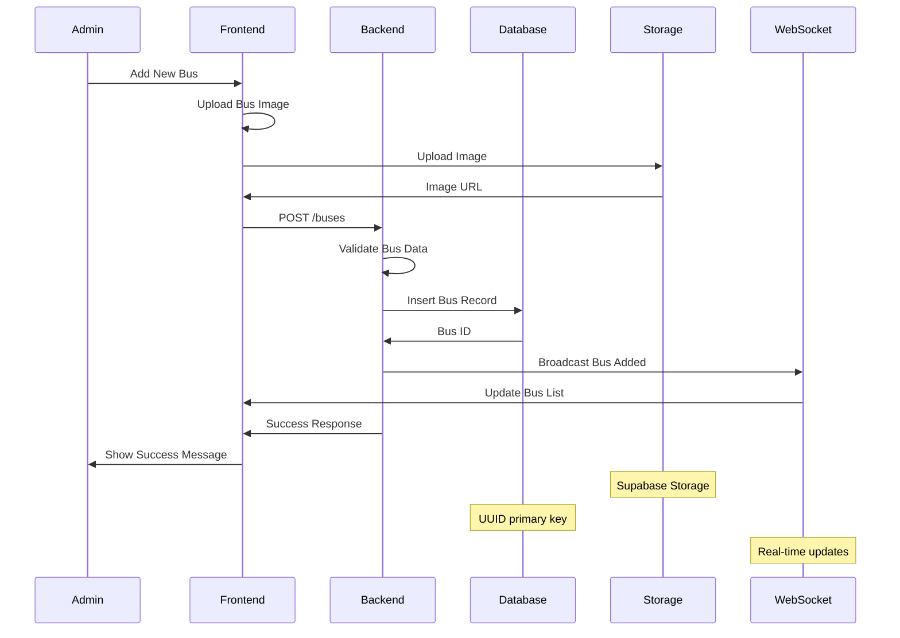

## 5. Route Management Data Flow

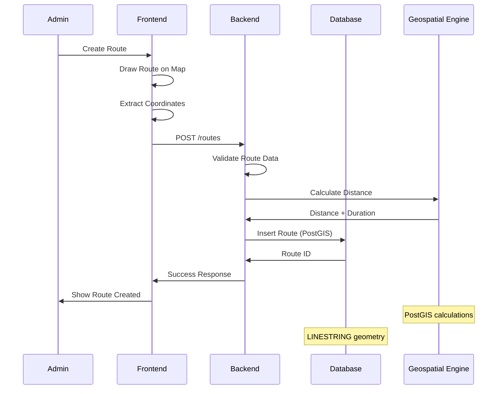

## 6. File Upload Data Flow

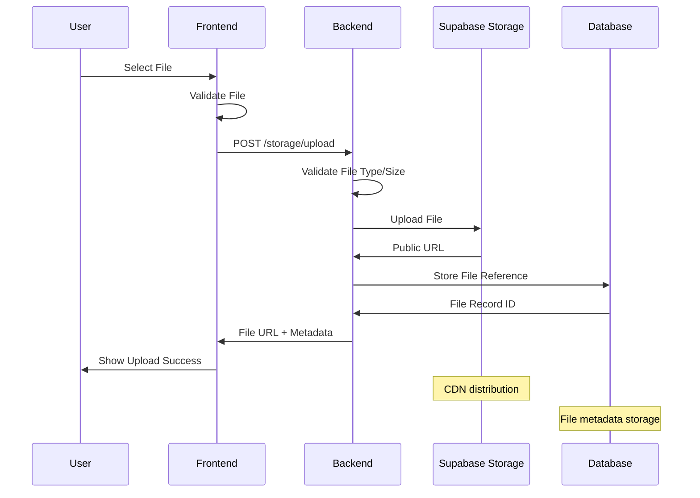

## 7. WebSocket Communication Data Flow

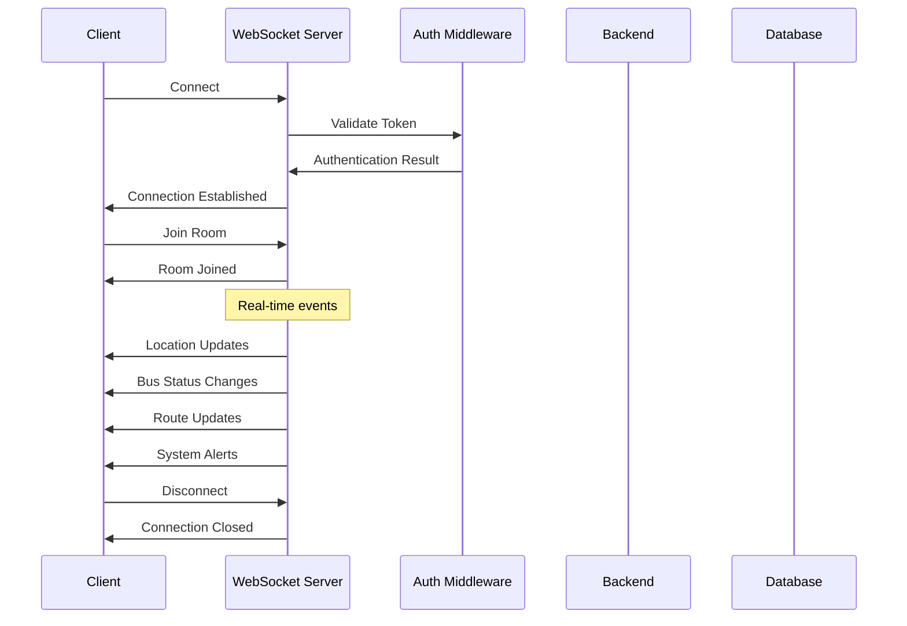

## 8. Analytics Data Flow

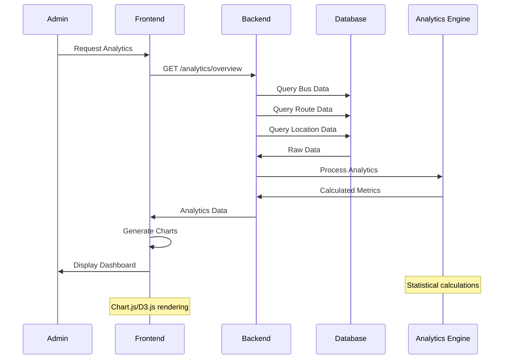

## 9. Error Handling Data Flow

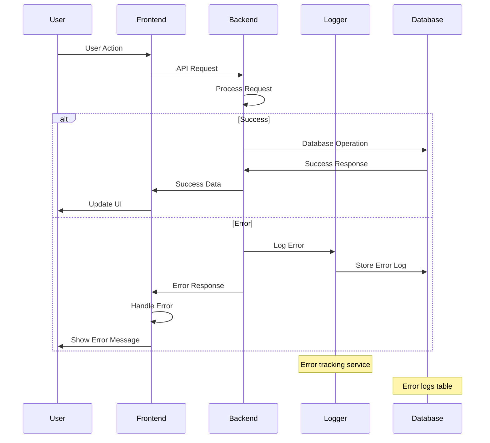

## 10. Data Synchronization Flow

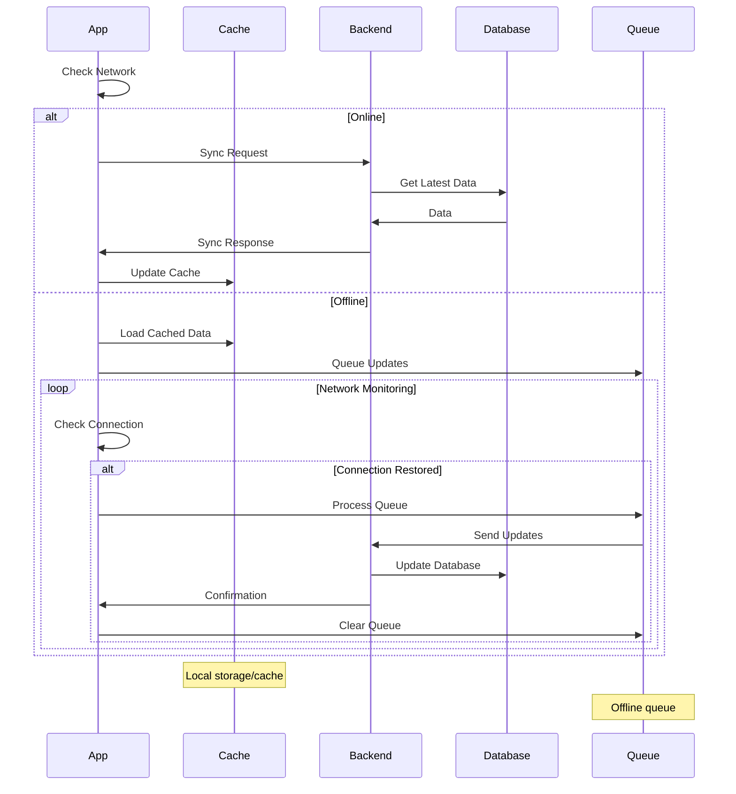

## 11. Security Data Flow

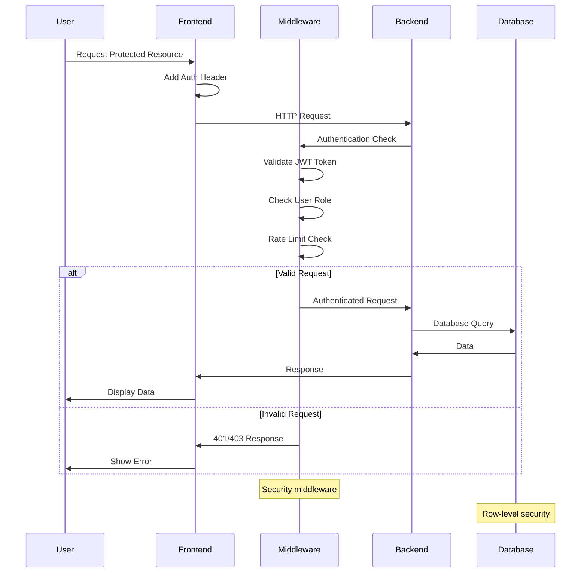

## 12. Performance Monitoring Data Flow

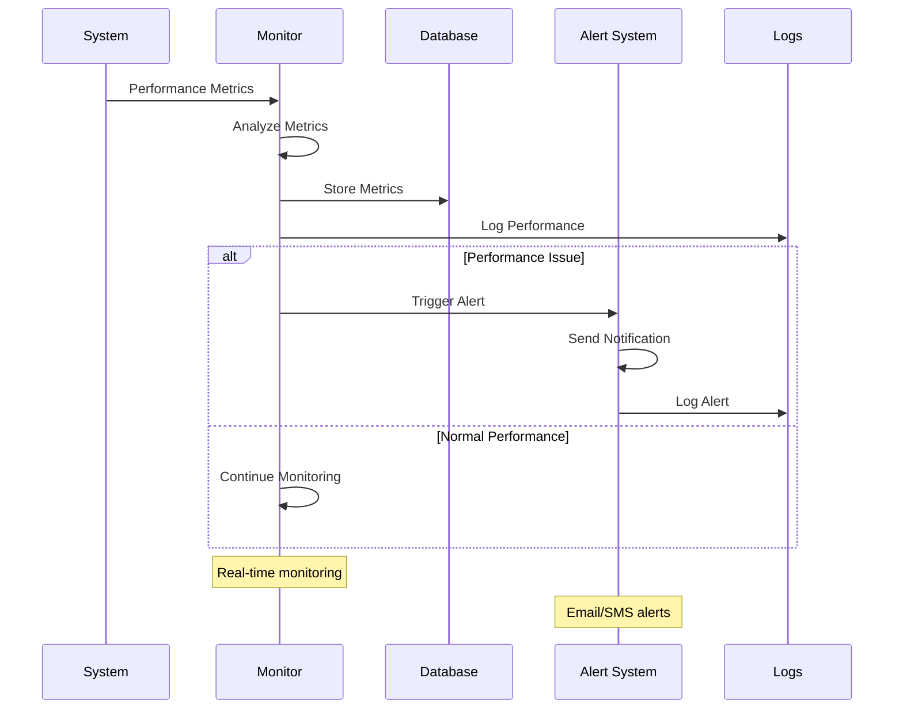

## Data Flow Patterns

### 1. Request-Response Pattern
- **Use Case**: CRUD operations, data retrieval
- **Flow**: Client → API → Database → Response
- **Example**: Fetching bus list, creating new routes

### 2. Real-time Broadcasting Pattern
- **Use Case**: Location updates, status changes
- **Flow**: Source → WebSocket → All Connected Clients
- **Example**: Bus location updates, system alerts

### 3. Event-Driven Pattern
- **Use Case**: Asynchronous operations, notifications
- **Flow**: Event → Queue → Processing → Notification
- **Example**: File upload completion, error alerts

### 4. Caching Pattern
- **Use Case**: Frequently accessed data, performance optimization
- **Flow**: Request → Cache Check → Database (if needed) → Cache Update
- **Example**: Route data, user preferences

### 5. Offline-First Pattern
- **Use Case**: Mobile applications, network resilience
- **Flow**: Local Cache → Sync Queue → Server Sync
- **Example**: Driver app location updates

## Data Transformation Points

### 1. Frontend Data Transformation
```typescript
// API Response to UI State
interface ApiResponse {
  id: string;
  latitude: number;
  longitude: number;
  timestamp: string;
}

interface UIState {
  position: [number, number];
  lastUpdate: Date;
  isActive: boolean;
}

// Transformation
const transformLocation = (apiData: ApiResponse): UIState => ({
  position: [apiData.latitude, apiData.longitude],
  lastUpdate: new Date(apiData.timestamp),
  isActive: true
});
```

### 2. Backend Data Transformation
```typescript
// Database to API Response
interface DatabaseRecord {
  id: string;
  location: string; // PostGIS geometry
  recorded_at: Date;
}

interface ApiResponse {
  id: string;
  latitude: number;
  longitude: number;
  timestamp: string;
}

// Transformation
const transformLocationRecord = (dbRecord: DatabaseRecord): ApiResponse => {
  const coords = parsePostGIS(dbRecord.location);
  return {
    id: dbRecord.id,
    latitude: coords.lat,
    longitude: coords.lng,
    timestamp: dbRecord.recorded_at.toISOString()
  };
};
```

### 3. Geospatial Data Transformation
```typescript
// Coordinate System Transformations
interface WGS84Coordinates {
  latitude: number;
  longitude: number;
}

interface ProjectedCoordinates {
  x: number;
  y: number;
  srid: number;
}

// Transform WGS84 to Web Mercator for map display
const transformToWebMercator = (coords: WGS84Coordinates): ProjectedCoordinates => {
  // PostGIS ST_Transform calculation
  return {
    x: calculateX(coords.longitude),
    y: calculateY(coords.latitude),
    srid: 3857
  };
};
```

These data flow diagrams provide a comprehensive understanding of how data moves through the University Bus Tracking System, from user interactions to database storage and real-time communication.
