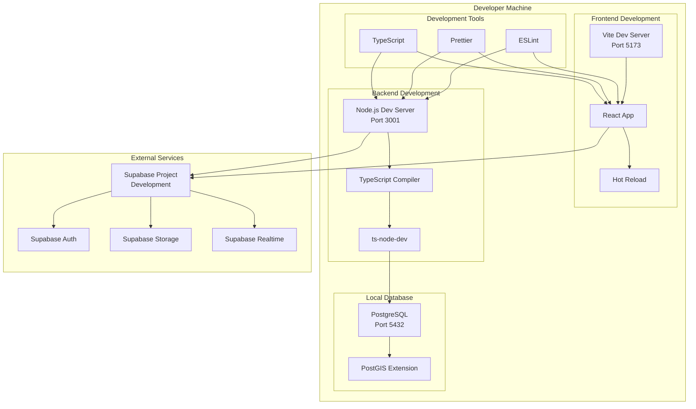
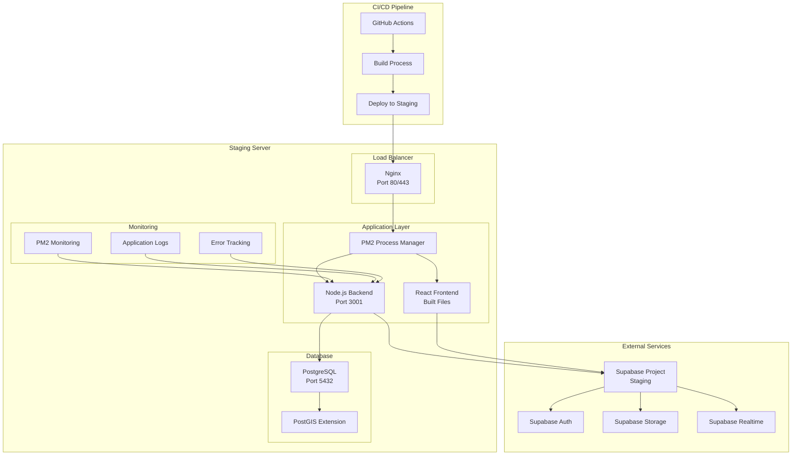
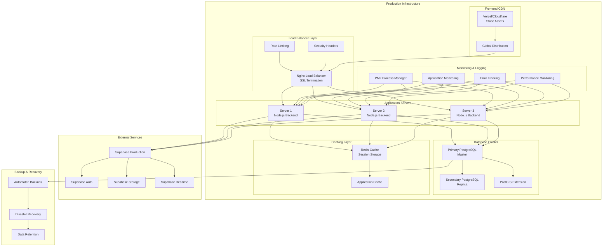
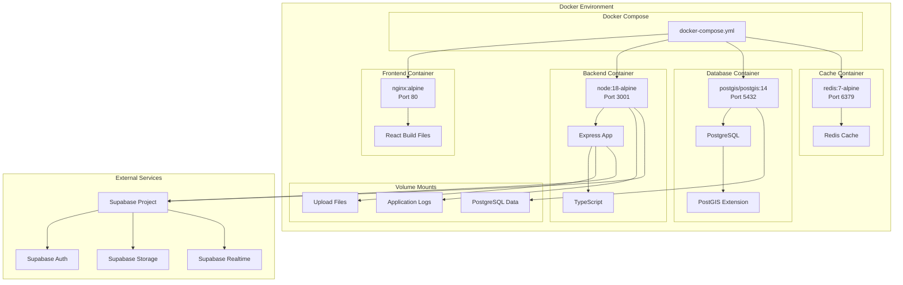
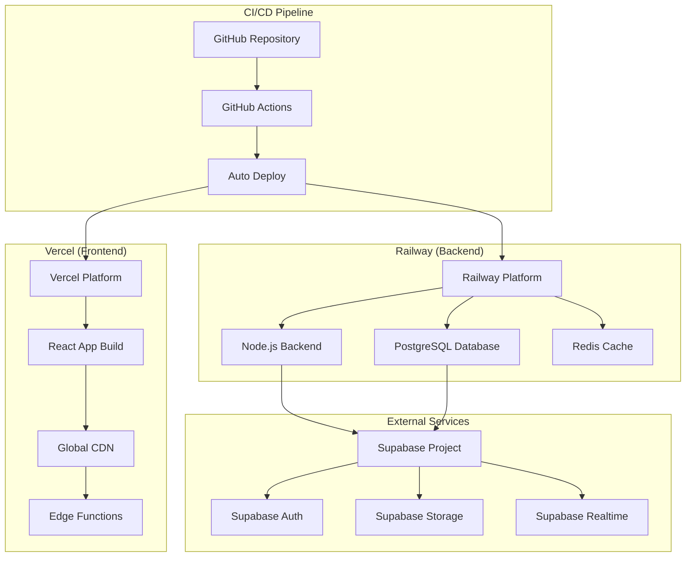
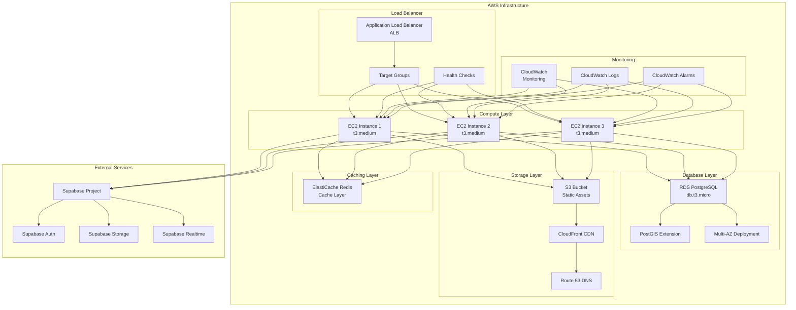
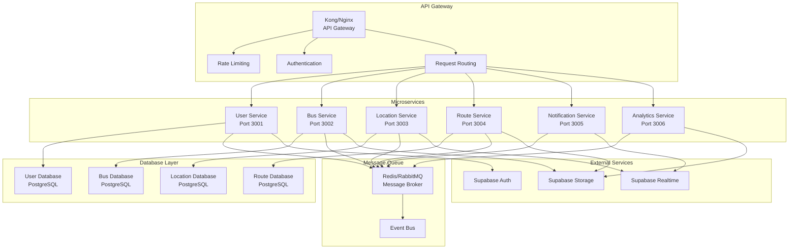
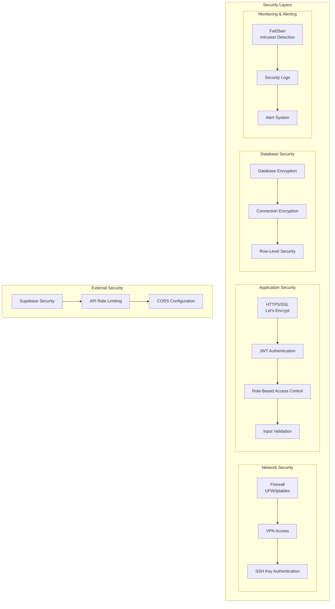
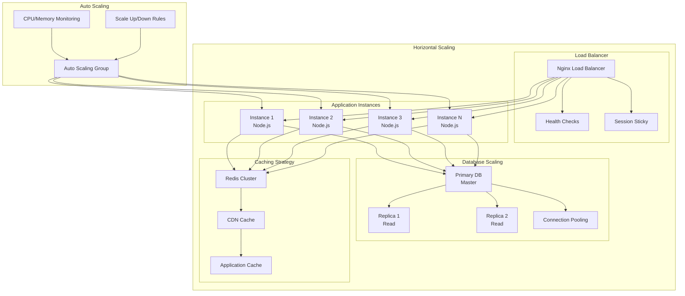

# Deployment Architecture

## Overview

This document provides detailed deployment architecture diagrams for the University Bus Tracking System, covering development, staging, and production environments with various deployment options.

## 1. Development Environment Architecture



## 2. Staging Environment Architecture



## 3. Production Environment Architecture



## 4. Docker Deployment Architecture



## 5. Cloud Platform Deployment

### 5.1 Vercel + Railway Deployment



### 5.2 AWS Deployment Architecture



## 6. Microservices Architecture (Future)



## 7. Security Architecture



## 8. Scaling Architecture



## Deployment Configuration Files

### Docker Compose Configuration

```yaml
version: '3.8'

services:
  frontend:
    build:
      context: .
      dockerfile: frontend/Dockerfile
    ports:
      - "80:80"
    depends_on:
      - backend
    environment:
      - VITE_API_URL=http://backend:3001
      - VITE_SUPABASE_URL=${SUPABASE_URL}
      - VITE_SUPABASE_ANON_KEY=${SUPABASE_ANON_KEY}

  backend:
    build:
      context: .
      dockerfile: backend/Dockerfile
    ports:
      - "3001:3001"
    depends_on:
      - db
      - redis
    environment:
      - NODE_ENV=production
      - DATABASE_URL=postgresql://user:password@db:5432/bus_tracking
      - REDIS_URL=redis://redis:6379
      - SUPABASE_URL=${SUPABASE_URL}
      - SUPABASE_ANON_KEY=${SUPABASE_ANON_KEY}
      - SUPABASE_SERVICE_ROLE_KEY=${SUPABASE_SERVICE_ROLE_KEY}
      - JWT_SECRET=${JWT_SECRET}

  db:
    image: postgis/postgis:14-3.2
    environment:
      - POSTGRES_DB=bus_tracking
      - POSTGRES_USER=user
      - POSTGRES_PASSWORD=password
    volumes:
      - postgres_data:/var/lib/postgresql/data
      - ./sql:/docker-entrypoint-initdb.d
    ports:
      - "5432:5432"

  redis:
    image: redis:7-alpine
    ports:
      - "6379:6379"
    volumes:
      - redis_data:/data

volumes:
  postgres_data:
  redis_data:
```

### Nginx Configuration

```nginx
# Main server configuration
server {
    listen 80;
    server_name your-domain.com;
    return 301 https://$server_name$request_uri;
}

server {
    listen 443 ssl http2;
    server_name your-domain.com;

    # SSL Configuration
    ssl_certificate /etc/letsencrypt/live/your-domain.com/fullchain.pem;
    ssl_certificate_key /etc/letsencrypt/live/your-domain.com/privkey.pem;
    ssl_protocols TLSv1.2 TLSv1.3;
    ssl_ciphers ECDHE-RSA-AES256-GCM-SHA512:DHE-RSA-AES256-GCM-SHA512;
    ssl_prefer_server_ciphers off;

    # Security Headers
    add_header X-Frame-Options "SAMEORIGIN" always;
    add_header X-XSS-Protection "1; mode=block" always;
    add_header X-Content-Type-Options "nosniff" always;
    add_header Referrer-Policy "no-referrer-when-downgrade" always;

    # Frontend
    location / {
        root /var/www/bus-tracking/frontend/dist;
        try_files $uri $uri/ /index.html;
        
        # Cache static assets
        location ~* \.(js|css|png|jpg|jpeg|gif|ico|svg)$ {
            expires 1y;
            add_header Cache-Control "public, immutable";
        }
    }

    # Backend API
    location /api/ {
        proxy_pass http://localhost:3001/;
        proxy_http_version 1.1;
        proxy_set_header Upgrade $http_upgrade;
        proxy_set_header Connection 'upgrade';
        proxy_set_header Host $host;
        proxy_set_header X-Real-IP $remote_addr;
        proxy_set_header X-Forwarded-For $proxy_add_x_forwarded_for;
        proxy_set_header X-Forwarded-Proto $scheme;
        proxy_cache_bypass $http_upgrade;
        
        # Rate limiting
        limit_req zone=api burst=20 nodelay;
    }

    # WebSocket
    location /socket.io/ {
        proxy_pass http://localhost:3001;
        proxy_http_version 1.1;
        proxy_set_header Upgrade $http_upgrade;
        proxy_set_header Connection "upgrade";
        proxy_set_header Host $host;
        proxy_set_header X-Real-IP $remote_addr;
        proxy_set_header X-Forwarded-For $proxy_add_x_forwarded_for;
        proxy_set_header X-Forwarded-Proto $scheme;
    }
}

# Rate limiting
limit_req_zone $binary_remote_addr zone=api:10m rate=10r/s;
```

This deployment architecture provides comprehensive coverage of different deployment scenarios, from simple development setups to complex production environments with high availability and scalability.
