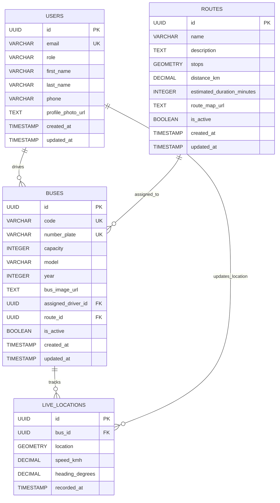

# Entity Relationship (ER) Diagram

## Database Schema Overview

The University Bus Tracking System uses a PostgreSQL database with PostGIS extension for geospatial data handling. The system consists of 4 main entities with their relationships.

## ER Diagram



## Entity Details

### 1. USERS Table
**Purpose**: Stores user information for authentication and role-based access control.

**Attributes**:
- `id` (UUID, Primary Key): Unique identifier for each user
- `email` (VARCHAR(255), Unique): User's email address for login
- `role` (VARCHAR(50)): User role - 'student', 'driver', or 'admin'
- `first_name` (VARCHAR(100)): User's first name
- `last_name` (VARCHAR(100)): User's last name
- `phone` (VARCHAR(20)): Contact phone number
- `profile_photo_url` (TEXT): URL to user's profile photo
- `created_at` (TIMESTAMP): Account creation timestamp
- `updated_at` (TIMESTAMP): Last update timestamp

**Constraints**:
- Role must be one of: 'student', 'driver', 'admin'
- Email must be unique across all users

### 2. ROUTES Table
**Purpose**: Defines bus routes with geospatial data for navigation.

**Attributes**:
- `id` (UUID, Primary Key): Unique identifier for each route
- `name` (VARCHAR(100)): Route name/identifier
- `description` (TEXT): Detailed route description
- `stops` (GEOMETRY(LINESTRING, 4326)): PostGIS geometry representing route path
- `distance_km` (DECIMAL(10,2)): Total route distance in kilometers
- `estimated_duration_minutes` (INTEGER): Expected travel time in minutes
- `route_map_url` (TEXT): URL to route map image
- `is_active` (BOOLEAN): Whether route is currently active
- `created_at` (TIMESTAMP): Route creation timestamp
- `updated_at` (TIMESTAMP): Last update timestamp

**Constraints**:
- Distance must be positive
- Duration must be positive

### 3. BUSES Table
**Purpose**: Stores information about university buses and their assignments.

**Attributes**:
- `id` (UUID, Primary Key): Unique identifier for each bus
- `code` (VARCHAR(20), Unique): Bus code/identifier
- `number_plate` (VARCHAR(20), Unique): Vehicle registration number
- `capacity` (INTEGER): Maximum passenger capacity
- `model` (VARCHAR(100)): Bus model/make
- `year` (INTEGER): Manufacturing year
- `bus_image_url` (TEXT): URL to bus image
- `assigned_driver_id` (UUID, Foreign Key): Reference to assigned driver
- `route_id` (UUID, Foreign Key): Reference to assigned route
- `is_active` (BOOLEAN): Whether bus is currently active
- `created_at` (TIMESTAMP): Bus registration timestamp
- `updated_at` (TIMESTAMP): Last update timestamp

**Constraints**:
- Capacity must be positive
- Year must be reasonable (1900-2030)
- Code and number plate must be unique

### 4. LIVE_LOCATIONS Table
**Purpose**: Tracks real-time location data for active buses.

**Attributes**:
- `id` (UUID, Primary Key): Unique identifier for each location record
- `bus_id` (UUID, Foreign Key): Reference to the bus being tracked
- `location` (GEOMETRY(POINT, 4326)): PostGIS point geometry (latitude, longitude)
- `speed_kmh` (DECIMAL(5,2)): Current speed in km/h
- `heading_degrees` (DECIMAL(5,2)): Direction of travel in degrees
- `recorded_at` (TIMESTAMP): When location was recorded

**Constraints**:
- Speed must be non-negative
- Heading must be between 0-360 degrees

## Relationships

### 1. USERS → BUSES (One-to-Many)
- **Relationship**: A user (driver) can be assigned to multiple buses
- **Foreign Key**: `buses.assigned_driver_id` references `users.id`
- **Business Rule**: Only users with role 'driver' can be assigned to buses

### 2. ROUTES → BUSES (One-to-Many)
- **Relationship**: A route can have multiple buses assigned to it
- **Foreign Key**: `buses.route_id` references `routes.id`
- **Business Rule**: Buses can only be assigned to active routes

### 3. BUSES → LIVE_LOCATIONS (One-to-Many)
- **Relationship**: A bus can have multiple location records over time
- **Foreign Key**: `live_locations.bus_id` references `buses.id`
- **Business Rule**: Only active buses should have location records

### 4. USERS → LIVE_LOCATIONS (One-to-Many)
- **Relationship**: A driver can update multiple location records
- **Business Rule**: Location updates are typically made by the assigned driver

## Database Indexes

### Performance Indexes
```sql
-- Live locations indexes for real-time queries
CREATE INDEX idx_live_locations_bus_id ON live_locations(bus_id);
CREATE INDEX idx_live_locations_recorded_at ON live_locations(recorded_at);
CREATE INDEX idx_live_locations_location ON live_locations USING GIST(location);

-- User lookup indexes
CREATE INDEX idx_users_email ON users(email);

-- Bus lookup indexes
CREATE INDEX idx_buses_number_plate ON buses(number_plate);

-- Route geospatial index
CREATE INDEX idx_routes_stops ON routes USING GIST(stops);
```

## Sample Data

### Users
```sql
INSERT INTO users (email, role, first_name, last_name) VALUES
('admin@university.edu', 'admin', 'Admin', 'User'),
('driver1@university.edu', 'driver', 'John', 'Driver'),
('student1@university.edu', 'student', 'Alice', 'Student');
```

### Routes
```sql
INSERT INTO routes (name, description, stops, distance_km, estimated_duration_minutes) VALUES
('Route 1: Ahmedabad to Gandhinagar', 'Main campus route', 
 ST_GeomFromText('LINESTRING(72.5714 23.0225, 72.6369 23.2154)', 4326),
 25.5, 45);
```

### Buses
```sql
INSERT INTO buses (code, number_plate, capacity, model, year) VALUES
('BUS001', 'UNI001', 50, 'Mercedes-Benz O500', 2020),
('BUS002', 'UNI002', 45, 'Volvo B7R', 2019),
('BUS003', 'UNI003', 55, 'Scania K250', 2021);
```

### Live Locations
```sql
INSERT INTO live_locations (bus_id, location, speed_kmh, heading_degrees) VALUES
((SELECT id FROM buses WHERE number_plate = 'UNI001' LIMIT 1),
 ST_GeomFromText('POINT(72.5714 23.0225)', 4326), 35.5, 45.0);
```

## Data Integrity Rules

### 1. Referential Integrity
- All foreign key relationships are enforced by the database
- Cascade delete for live_locations when a bus is deleted
- No cascade delete for user-bus relationships (preserve user data)

### 2. Business Rules
- Only active buses can have location updates
- Only drivers can be assigned to buses
- Routes must have valid geospatial data
- Location coordinates must be within reasonable bounds

### 3. Data Validation
- Email format validation
- Phone number format validation
- Geographic coordinate validation
- Speed and heading range validation

## Geospatial Features

### PostGIS Integration
- **Point Geometry**: Live bus locations stored as PostGIS points
- **LineString Geometry**: Route paths stored as PostGIS linestrings
- **Spatial Indexes**: GIST indexes for efficient geospatial queries
- **Coordinate System**: WGS84 (EPSG:4326) for global compatibility

### Geospatial Queries
```sql
-- Find buses within 1km of a point
SELECT b.* FROM buses b
JOIN live_locations ll ON b.id = ll.bus_id
WHERE ST_DWithin(ll.location, ST_Point(72.5714, 23.0225), 0.01);

-- Calculate distance between bus and route
SELECT ST_Distance(ll.location, r.stops) as distance
FROM live_locations ll
JOIN buses b ON ll.bus_id = b.id
JOIN routes r ON b.route_id = r.id;
```

This ER diagram provides a complete overview of the database schema, relationships, and constraints for the University Bus Tracking System.
