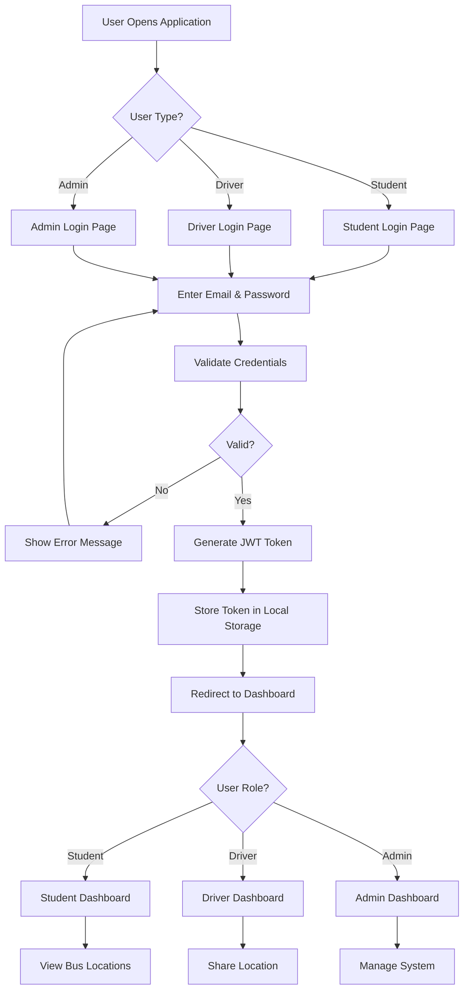
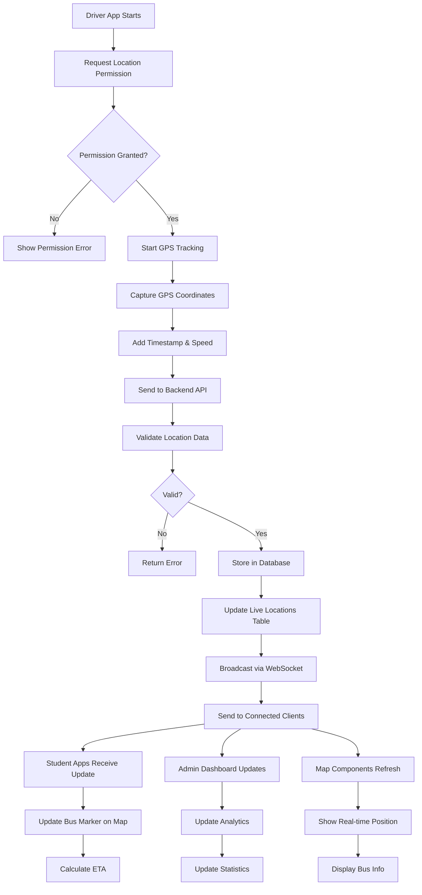
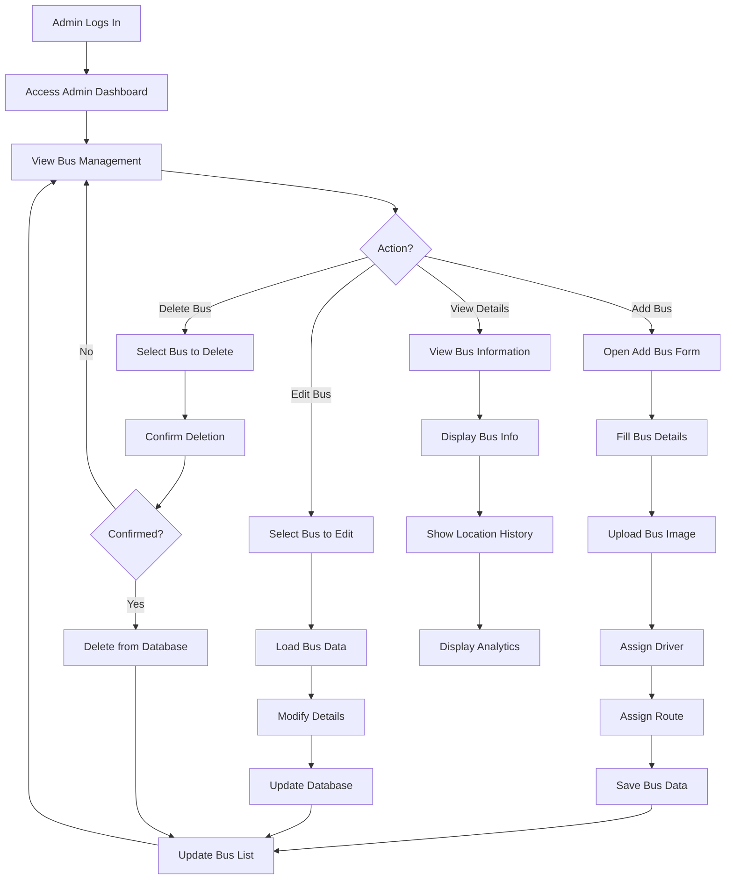
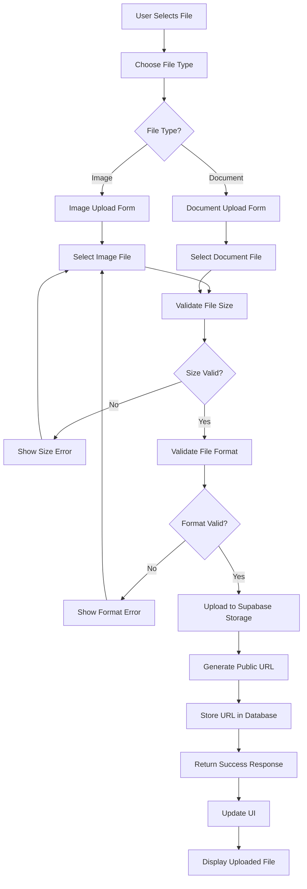
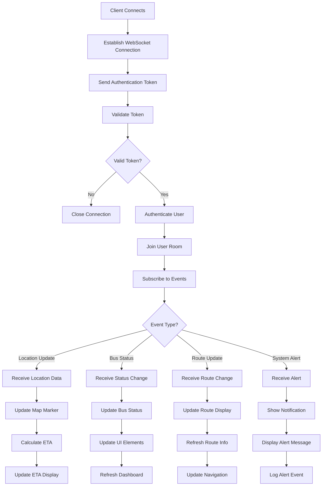
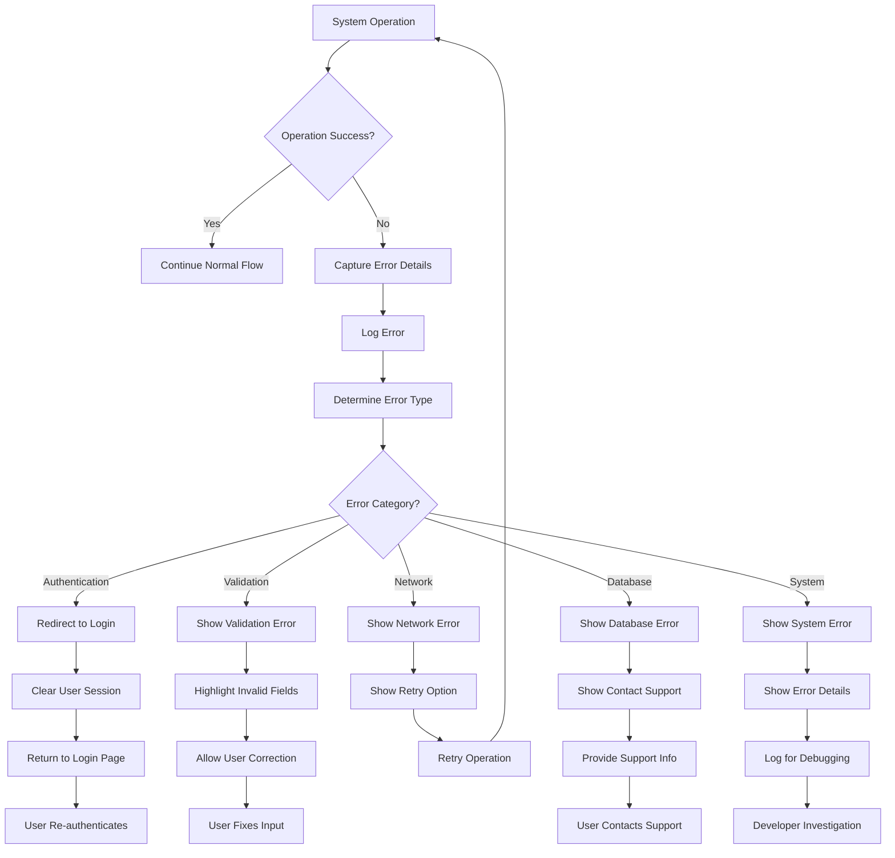
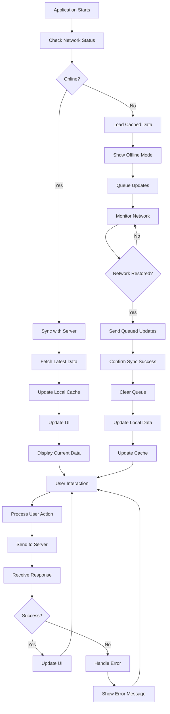
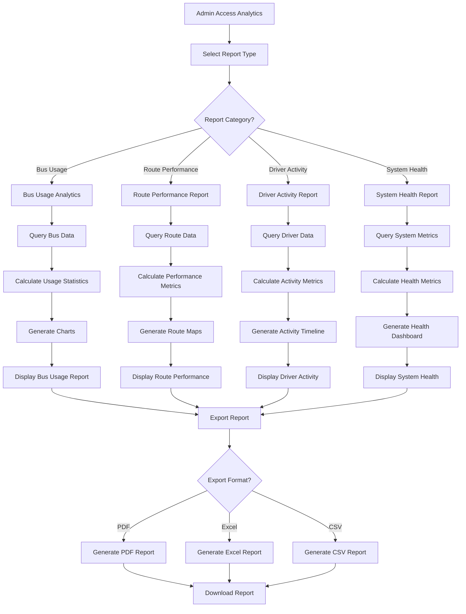
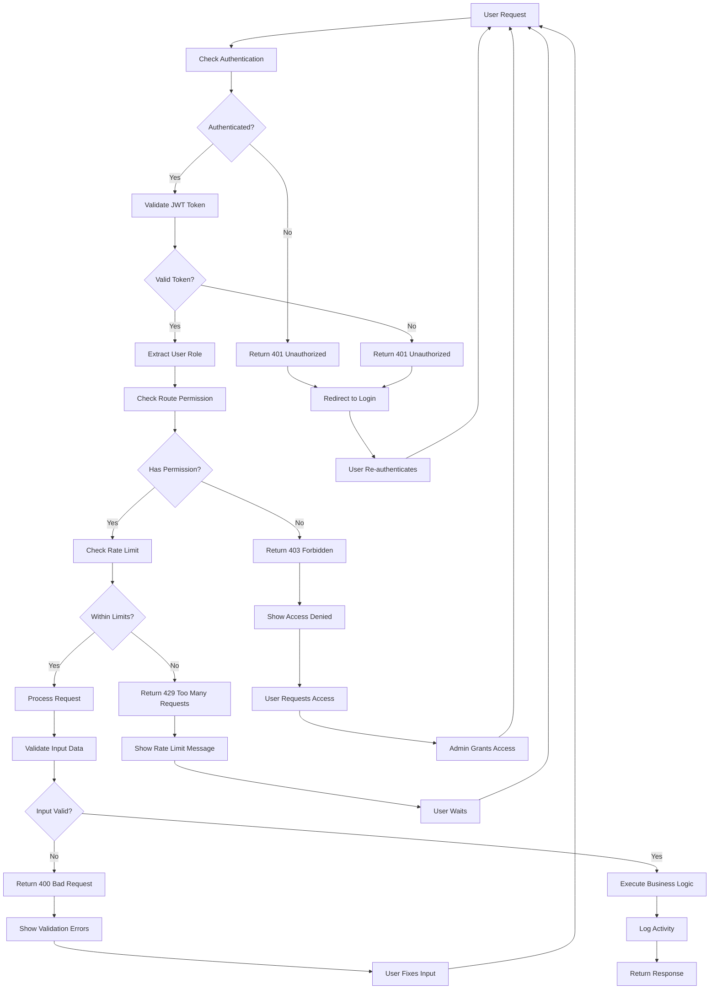

# System Flowcharts

## Overview

This document contains detailed flowcharts for the University Bus Tracking System, showing user interactions, data flow, authentication processes, and system operations.

## 1. User Authentication Flow

## 2. Real-Time Location Tracking Flow

## 3. Bus Management Flow (Admin)

## 4. Route Management Flow

```mermaid
flowchart TD
    A[Admin Access Route Management] --> B{Action?}
    
    B -->|Create Route| C[Open Route Creation Form]
    B -->|Edit Route| D[Select Existing Route]
    B -->|Delete Route| E[Select Route to Delete]
    B -->|View Route| F[Display Route Details]
    
    C --> G[Enter Route Name]
    G --> H[Add Description]
    H --> I[Draw Route on Map]
    I --> J[Set Stops/Coordinates]
    J --> K[Calculate Distance]
    K --> L[Set Duration]
    L --> M[Upload Route Map]
    M --> N[Save Route]
    
    D --> O[Load Route Data]
    O --> P[Modify Route Details]
    P --> Q[Update Route Path]
    Q --> R[Save Changes]
    
    E --> S[Confirm Route Deletion]
    S --> T{Confirmed?}
    T -->|No| B
    T -->|Yes| U[Delete Route]
    
    F --> V[Show Route on Map]
    V --> W[Display Bus Assignments]
    W --> X[Show Route Statistics]
    
    N --> Y[Update Route List]
    R --> Y
    U --> Y
    Y --> B
```

## 5. File Upload Flow

## 6. WebSocket Communication Flow

## 7. Error Handling Flow

## 8. Data Synchronization Flow

## 9. Analytics and Reporting Flow

## 10. Security and Access Control Flow

These flowcharts provide a comprehensive view of how the University Bus Tracking System operates, from user authentication to real-time data processing and system management.
