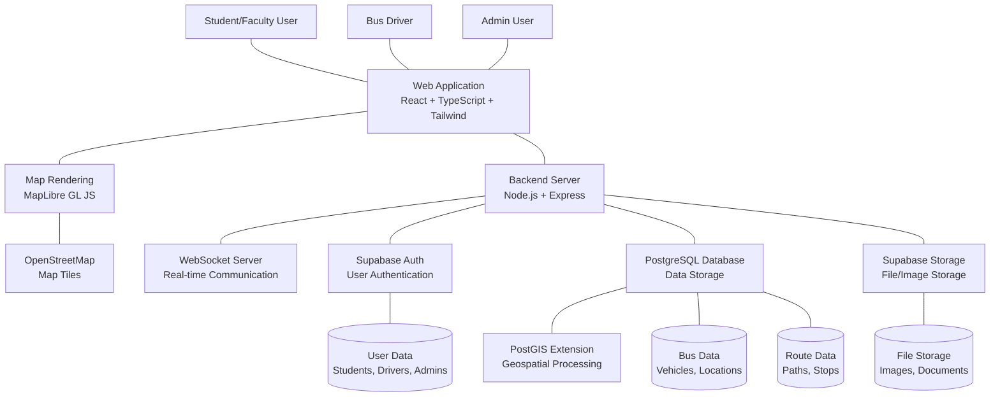
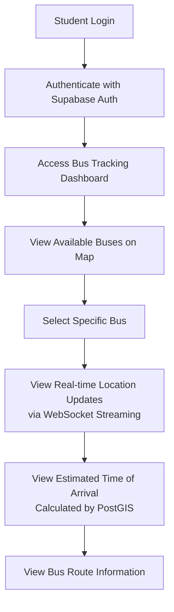
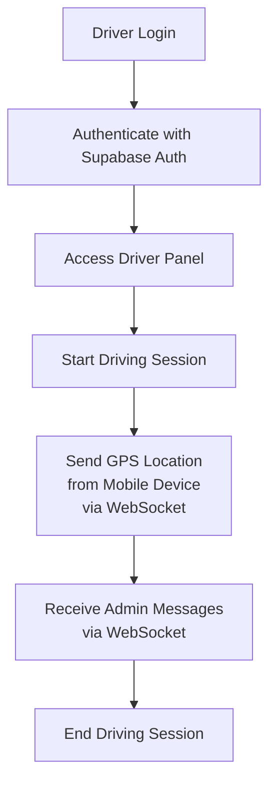
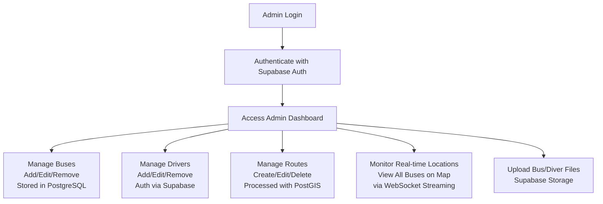
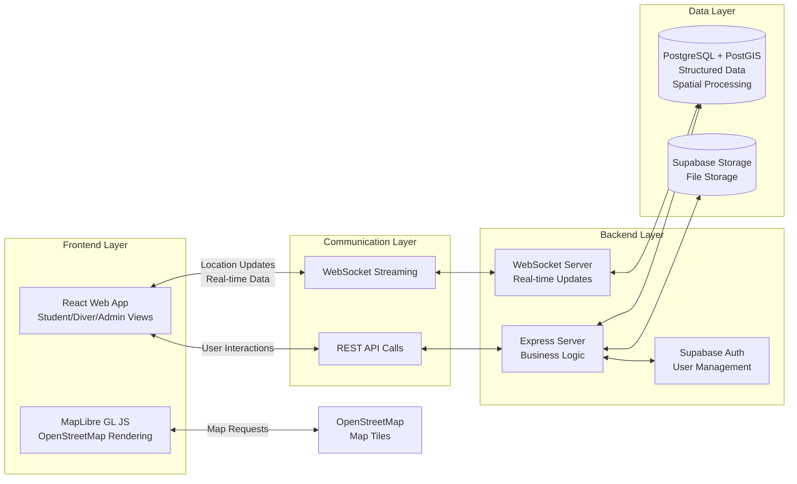

# University Bus Tracking System - System Overview Flowchart

## System Architecture Overview

## Student User Flow

## Driver Flow

## Admin Flow

## Detailed System Components

### Core Technologies
- **Frontend**: React with TypeScript and Tailwind CSS
- **Mapping**: MapLibre GL JS with OpenStreetMap tiles
- **Backend**: Node.js with Express framework
- **Real-time Communication**: WebSocket streaming
- **Authentication**: Supabase Auth (email/password)
- **Database**: PostgreSQL with PostGIS extension
- **Storage**: Supabase Storage

### Data Flow Overview

### Key Processes and Data Stores

| Component | Function | Technology |
|-----------|----------|------------|
| **User Authentication** | Handle login/logout for all user types | Supabase Auth |
| **Real-time Tracking** | Stream location updates from drivers to students | WebSocket |
| **Map Rendering** | Display buses, routes, and locations | MapLibre + OSM |
| **Route Calculation** | Calculate ETAs and optimal paths | PostGIS |
| **Data Storage** | Store buses, drivers, routes, and user info | PostgreSQL |
| **File Storage** | Store images and documents | Supabase Storage |

### Data Stores

1. **User Data Store** - Contains student, driver, and admin information (Supabase Auth)
2. **Bus Data Store** - Contains vehicle information and real-time locations (PostgreSQL)
3. **Route Data Store** - Contains route paths, stops, and scheduling (PostgreSQL + PostGIS)
4. **File Storage** - Contains images and documents (Supabase Storage)